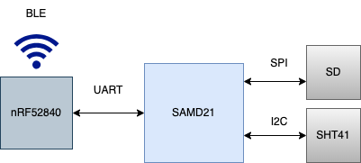
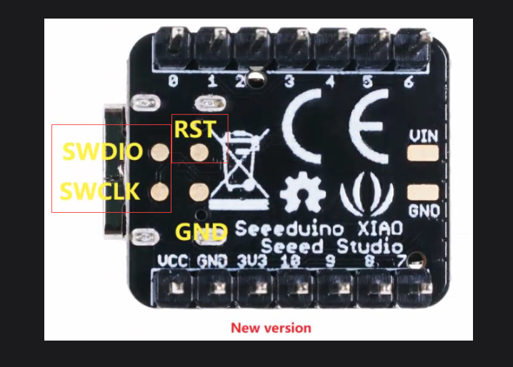
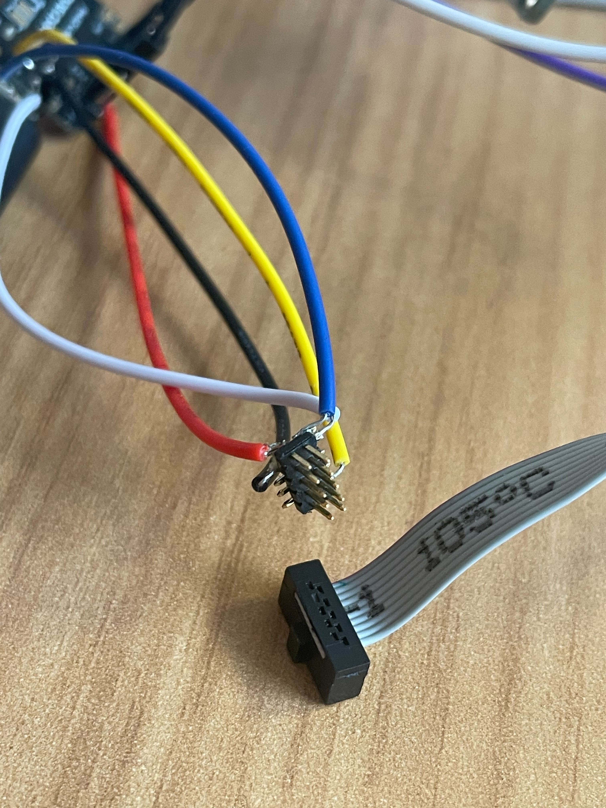
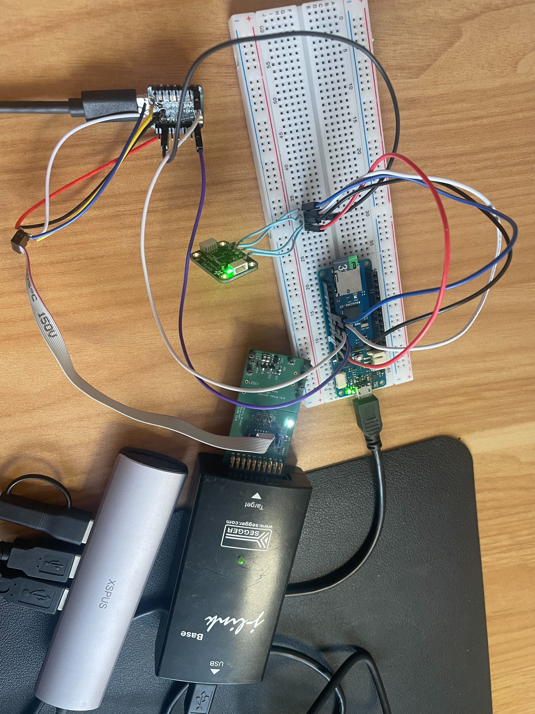
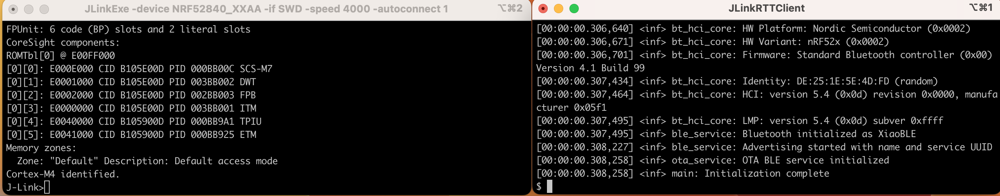
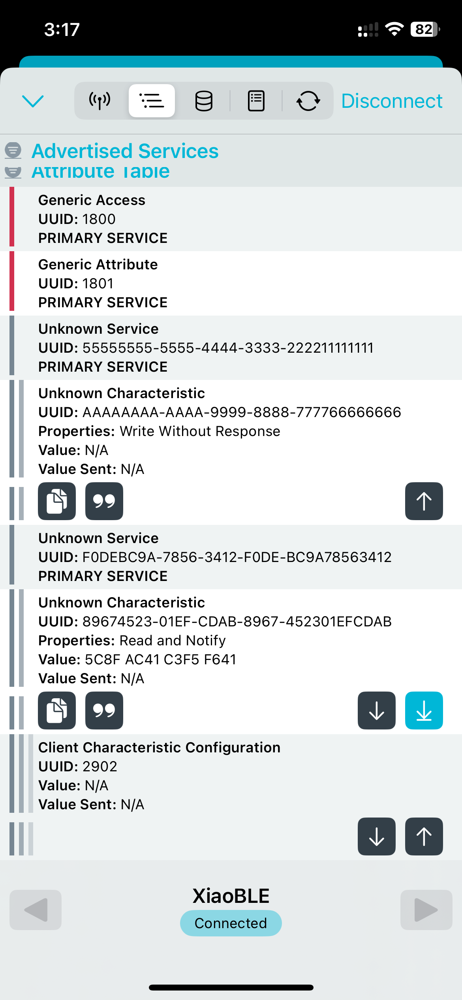
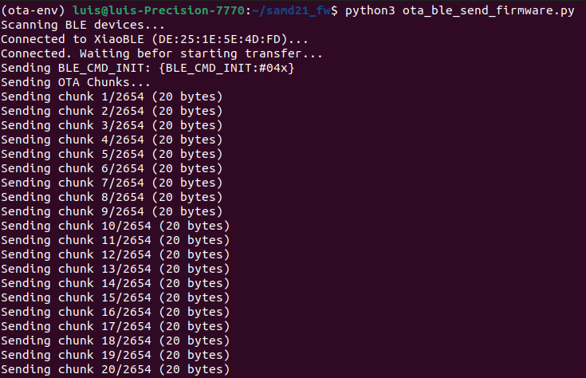

# BLE Platform Firmware – nRF52840 + SAMD21

This repository contains the firmware for a multi-MCU BLE platform. The system consists of an **nRF52840** (central processor and BLE communication hub) and a **SAMD21** (sensor acquisition and OTA update target).

## Overview

This project implements a multi-MCU firmware architecture for a BLE device platform:

- Firmware for both the nRF52840 and SAMD21 platforms

- UART-based communication protocol between the two MCUs

- Periodic BLE transmission of sensor data from the nRF52840

- OTA update mechanism that receives firmware over BLE and forwards it to the SAMD21 via UART

## System Architecture

The system architecture is based on:

- **nRF52840 (XIAO BLE)** – Handles BLE communication, OTA firmware reception, UART forwarding.
- **SAMD21 (Arduino MKR Zero)** – Reads sensor data, receives firmware updates via UART, writes to SD card, and performs firmware swaps on reboot
- **SHT41 Sensor** – Connected to the SAMD21 via I2C, used to measure environmental temperature and humidity.

**Block Diagram:**



## Build Instructions

### nRF52840 Firmware (Zephyr RTOS)

1. **Requirements:**
   - Zephyr SDK 0.17.0 or higher
   - `west` tool installed
   - Board defined as `xiao_ble`
   - Project located at:
zephyrproject/app/multi-mcu-ble-ota-firmware/nrf52840_firmware

2. **Build & Flash:**
```bash
cd ~/zephyrproject/app/multi-mcu-ble-ota-firmware/nrf52840_firmware
west init -l .
west update
west build -b xiao_ble
west flash
```

3. **Debugging (SEGGER RTT):**

This project is configured for debugging using **SEGGER RTT**. To enable this, SWD (Serial Wire Debug) connections must be properly soldered.

1. **Soldering SWD lines:**  
   If you're using individual wires, connect SWDIO, SWDCLK, GND, and 3V as shown:

   

2. **Using a 2x5 SWD header:**  
   You can also solder a 2x5 SWD header as shown:

   

3. **Connecting to an external J-Link debugger:**  
   Once soldered, you can use an external J-Link programmer as shown:

   

4. **Running RTT logs:**  
   Open **two terminal windows**:

   - In **Terminal 1**, run:
     ```bash
     JLinkRTTClient
     ```

   - In **Terminal 2**, run:
     ```bash
     JLinkExe -device NRF52840_XXAA -if SWD -speed 4000 -autoconnect 1
     ```

   After successful connection, RTT output will appear.

   


### SAMD21 Firmware (Arduino-based)

1. **Requirements:**
   - Arduino IDE or PlatformIO
   - Board selected as "Arduino MKR Zero"
   - Dependencies installed (`SdFat`, `Adafruit_SHT4x`, `CRC`.)

2. **To build and upload:**
   - Open `multi-mcu-ble-ota-firmware/SAMD_APP/SAMD_APP.ino` in the Arduino IDE
   - Select the correct board and port
   - Click Upload

3. **For bootloader:**
   - Open `multi-mcu-ble-ota-firmware/ArduinoCore-samd/bootloaders/mkzerosamd21_sam_ba_arduino_mkrzero.bin/`
   - Flash once using SWD or bootloader method
   - Future updates can be sent via UART using OTA protocol with nRF52840
   - **Note**: The Arduino MKR Zero includes a built-in bootloader, so no additional flashing is required.


## Deliverables

- [nRF52840 Zephyr Firmware](nrf52840_firmware/)
- [SAMD21 Firmware (Arduino)](SAMD_APP/)
- [Firmware Architecture Documentation](docs/Firmware_Architecture.md)
- [OTA Python Scripts](docs/ota)


## Validation & Testing

### 1. Sensor Data Validation via BLE

To verify sensor data transmission, you can use the **nRF Connect** mobile app:

1. Open the app and **scan for BLE devices**
2. Connect to the device named **XiaoBLE**
3. Locate the custom **service and characteristic** shown in the screenshots below
4. Tap the **downward arrow icon** to subscribe to notifications
5. You should start seeing incoming values under the **"Value"** field

> This confirms that the nRF5280 is successfully receiving sensor data from the SAMD21 and transmitting it over BLE at regular intervals.

 

---

### 2. OTA Update Testing

To validate the OTA firmware update process, two Python scripts are provided in the [`docs/ota/`](docs/ota) folder:

- [`generate_ota_txt.py`](docs/generate_ota_txt.py)
- [`ota_ble_send_firmware.py`](docs/ota_ble_send_firmware.py)

#### Steps to run OTA:

1. Edit `generate_ota_txt.py`:
   - Set the `bin_file` parameter to the path of the firmware `.bin` you want to send
   - Set the `txt_file` parameter to define the output name for the chunked data

2. Run the script:
```bash
python3 generate_ota_txt.py
```
This will generate a `.txt` file with the binary split into 19-byte chunks.

3. Edit `ota_ble_send_firmware.py`:
   - Set the path to the `.txt` file you just generated

4. Run the OTA script:
```bash
python3 ota_ble_send_firmware.py
```

This will:
- Connect to the `XiaoBLE` device over BLE
- Send the OTA firmware chunks
- Trigger the UART-based forwarding from nRF52840 to SAMD21
- Reboot the SAMD21 to load the new firmware

 

---

### 3. Firmware Variants for Testing

For easier visual confirmation of firmware updates, the following `.bin` files are included in the `docs/ota/` folder:

- `SAMD_LED.ino.bin` – toggles an onboard LED each time it sends sensor data
- `SAM_NO_LED.ino.bin` – same functionality but without the LED toggle

Corresponding `.txt` files generated by `generate_ota_txt.py` are also included for immediate use.

---

### Notes for validation

- All OTA and BLE tests were performed on **Linux**, as **macOS** showed BLE stability issues (automatic disconnection during transfer).
- On Linux, make sure the following packages are installed for BLE support:
```bash
sudo apt install bluez python3-dbus python3-gi
```


---

## Other Notes

- The OTA protocol is UART-based and defined in a custom packet structure with CRC verification and ACKs.
- The system is designed for modularity and robustness against OTA failure.
- Further implementation details and diagrams can be found in the linked PDF documentation.
