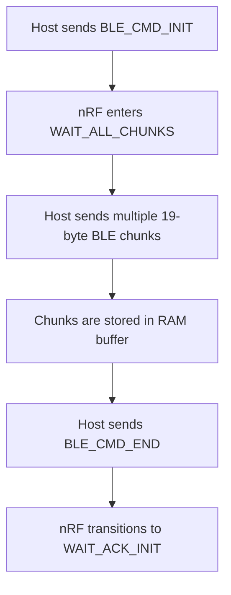
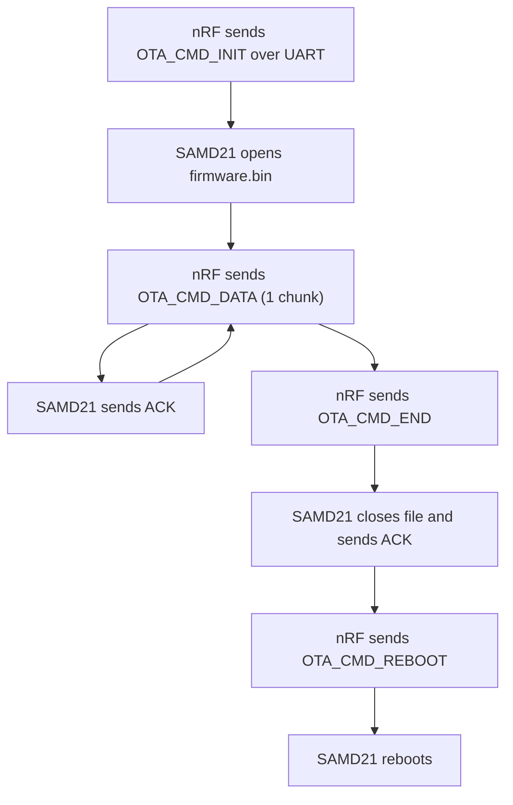

# Multi-MCU Firmware Architecture

Luis Burgos

## 1. System Overview

This project implements a multi-MCU BLE firmware platform composed of:

- **nRF52840 (XIAO BLE)** – Central processor, BLE hub, OTA manager
- **SAMD21 (MKR Zero)** – Sensor data acquisition, UART communication, firmware update target

The SAMD21 collects data from a temperature and humidity sensor (SHT4x), transmits it via UART to the nRF52840, which then broadcasts the data over BLE. The nRF52840 also handles OTA firmware updates over BLE and forwards them to the SAMD21 using a custom UART protocol.

## 2. Communication Protocol Documentation

### 2.1 MCU Roles and UART Communication Direction

| Component | Role                        | UART Communication                                                                          |
|-----------|-----------------------------|----------------------------------------------------------------------------------------------|
| SAMD21    | Sensor reader and OTA target| Sends: sensor data, OTA ACKs<br>Receives: OTA commands, OTA chunks                           |
| nRF52840  | BLE and OTA manager         | Sends: OTA commands, OTA data chunks<br>Receives: sensor data, ACKs from SAMD21              |

Communication between MCUs occurs via UART at 115200 bps with a custom packet-based protocol.

### 2.2 UART Packet Structure

All UART packets follow the same structure:

| Field Name | Size (bytes) | Description                                             |
|------------|--------------|---------------------------------------------------------|
| Preamble   | 1            | Fixed value `0xAA` to identify start of frame           |
| Type       | 1            | Packet type (Sensor, Command, ACK, OTA)                 |
| Length     | 1            | Length of the payload                                   |
| Payload    | Variable     | Data depending on packet type                           |
| CRC        | 1            | CRC-8 checksum of all previous bytes                    |

### 2.3 Packet Types

| Type (Hex) | Name          | Description                                        |
|------------|---------------|----------------------------------------------------|
| `0x01`     | `UART_PKT_SENSOR` | Sensor data frame sent from SAMD21 to nRF52840     |
| `0x02`     | `UART_PKT_CMD`    | Command packet (used for OTA control)              |
| `0x03`     | `UART_PKT_ACK`    | Acknowledgment frame for flow control              |

### 2.4 OTA Command Subtypes

OTA commands are sent using `UART_PKT_CMD` packets. The first byte of the payload indicates the OTA subcommand:

| Subcommand (Hex) | Name           | Description                                                         |
|------------------|----------------|---------------------------------------------------------------------|
| `0x00`           | `OTA_CMD_INIT` | Instructs the SAMD21 to prepare for a new OTA session. Creates file in SD. |
| `0x01`           | `OTA_CMD_DATA` | Sends a 19-byte chunk of the firmware                               |
| `0x02`           | `OTA_CMD_END`  | Signals end of transmission (close file)                            |
| `0x03`           | `OTA_CMD_REBOOT` | Reboots the SAMD21 to flash the new firmware                      |

All commands are acknowledged by the SAMD21 via a `UART_PKT_ACK` with a matching ID.

### 2.5 Example Payloads

| Description  | Direction           | Example Frame (Hex)                     |
|--------------|---------------------|-----------------------------------------|
| Sensor data  | SAMD21 → nRF52840   | `AA 01 04 08 C5 14 5C CRC`              |
| OTA Init     | nRF52840 → SAMD21   | `AA 02 01 00 CRC`                       |
| OTA Data (19 bytes) | nRF52840 → SAMD21 | `AA 02 13 01 <19 data bytes> CRC` |
| OTA End      | nRF52840 → SAMD21   | `AA 02 01 02 CRC`                       |
| OTA Reboot   | nRF52840 → SAMD21   | `AA 02 01 03 CRC`                       |
| ACK from SAMD21 | SAMD21 → nRF52840 | `AA 03 01 01 CRC`                      |

### 2.6 Sensor Data Transmission

- The SAMD21 reads values from the SHT4x sensor every 5 seconds.
- It packages temperature and humidity into a `UART_PKT_SENSOR` frame and transmits it to the nRF52840.

Example payload (hex): `AA 01 04 08 C5 14 5C CRC`

## 3. OTA Update Process

### 3.1 Overview

The firmware update process is initiated via BLE from a host (e.g., a Python script) and involves the following stages:

1. **BLE → nRF52840:** Firmware is sent from host to the nRF, chunk by chunk.  
2. **nRF52840 → SAMD21 (via UART):** Firmware chunks are forwarded.  
3. **SAMD21:** Stores the firmware to SD card, then reboots and flashes it.  

### 3.2 BLE OTA Transfer

The OTA process begins with the host sending BLE commands and firmware chunks to the nRF52840. This phase is limited to communication between the host and the nRF.

- Each BLE write contains 20 bytes:  
  - The **first byte must be `0x01`**, serving as a marker recognized by the nRF OTA handler to accept and queue the chunk.  
  - The remaining **19 bytes are data**, stored in RAM for later transmission.  

**BLE OTA commands**

```
#define BLE_CMD_INIT 0x10  // Start OTA session
#define BLE_CMD_END  0x11  // End OTA session
```

**OTA phases – nRF52840 state machine**

| Phase Name       | Description                                                                                  |
|------------------|----------------------------------------------------------------------------------------------|
| `IDLE`           | No OTA activity. System in normal mode, handling BLE and UART tasks.                        |
| `WAIT_ALL_CHUNKS`| OTA initiated via `BLE_CMD_INIT`. nRF buffers all 19-byte firmware chunks received over BLE. |
| `WAIT_ACK_INIT`  | All chunks received. `OTA_CMD_INIT` sent to SAMD21. Awaiting ACK before proceeding.         |
| `SENDING_DATA`   | Firmware chunks forwarded via UART using `OTA_CMD_DATA`. Each chunk is ACKed by SAMD21.     |
| `WAIT_ACK_END`   | `OTA_CMD_END` sent. nRF waits for final ACK/confirmation that SAMD21 completed SD write.    |
| `DONE`           | OTA completed. nRF sends `OTA_CMD_REBOOT` and resets internal buffers.                      |
| `ABORTED`        | OTA failed/timed out. Buffers cleared and system returns to `IDLE`.                         |

### 3.3 UART OTA Commands (nRF → SAMD21)

| Command        | Code  | Description                                                  |
|----------------|-------|--------------------------------------------------------------|
| `OTA_CMD_INIT` | 0x00  | Instructs SAMD21 to start a new OTA session (open file)      |
| `OTA_CMD_DATA` | 0x01  | Sends a 19-byte chunk of the firmware to SAMD21              |
| `OTA_CMD_END`  | 0x02  | Instructs SAMD21 to finalize the firmware and close the file |
| `OTA_CMD_REBOOT` | 0x03 | Reboots SAMD21 to flash the new firmware                    |

Each command is wrapped in a `UART_PKT_CMD` packet and must be acknowledged by the SAMD21 with a `UART_PKT_ACK`. If any ACK is not received within a timeout, the nRF retries or aborts the session.

### 3.4 SD Card and Boot Process (SAMD21)

- The SAMD21 stores all received chunks into a file named `firmware.bin` on the SD card.  
- Upon receiving `OTA_CMD_END`, the file is closed.  
- Upon receiving `OTA_CMD_REBOOT`, the SAMD21 renames `firmware.bin` to `UPDATE.BIN` and triggers a soft reset.  

**Bootloader behavior:** On boot, the custom bootloader on the SAMD21 checks for a file named `UPDATE.BIN` in the root of the SD card. If found, it flashes the file into internal memory, deletes it, and then jumps to the new firmware.

### 3.5 OTA-Specific Behaviors

- **Sensor suspend:** During OTA, the SAMD21 stops sending sensor data to avoid interference.  
- **Timeout recovery:** A watchdog timer on the SAMD21 resets to sensor mode if OTA does not complete.  
- **ACK-based flow control:** The nRF52840 waits for an ACK from the SAMD21 after every chunk to ensure safe delivery.  

## 4. Technical Implementation Decisions

### 4.1 Tools and Stack

| Component      | Stack                                           |
|----------------|-------------------------------------------------|
| nRF52840       | Zephyr RTOS, SEGGER RTT, custom BLE services    |
| SAMD21         | Arduino SDK, SD card handling (SdFat), custom UART protocol |
| Communication  | UART @ 115200 baud (8N1)                        |
| Storage        | microSD via SPI                                 |

### 4.2 Key Design Decisions

- Use of a **framed UART protocol** with preamble and CRC to detect/recover from errors.  
- **19-byte chunking** to align with BLE MTU and ensure stable OTA over BLE.  
- Implementation of **ACKs and timeouts** for robust UART communication.  
- **Non-blocking UART RX state machine** to avoid frame drops under load.  

### 4.3 Challenges and Solutions

| Issue                     | Root Cause                                      | Solution                                                 |
|---------------------------|-------------------------------------------------|----------------------------------------------------------|
| CRC errors during UART    | Concurrent sensor + OTA data                    | Disabled sensor TX during OTA                            |
| BLE disconnections on macOS | OS-level BLE instability                      | Performed validation on Linux                            |
| OTA buffer overflow on SAMD21 | No flow control during TX                   | Added ACK handshake + watchdog timeout + increased queue size |

## 5. BLE Services and Characteristics

The firmware running on the nRF52840 exposes two custom BLE services to handle data transmission and OTA updates.

### 5.1 Sensor Notification Service

| Element        | UUID                                   | Notes                          |
|----------------|----------------------------------------|--------------------------------|
| Service UUID   | `12345678-9abc-def0-1234-56789abcdef0` | Custom 128-bit UUID            |
| Characteristic | `abcdef01-2345-6789-abcd-ef0123456789` | Supports `READ` and `NOTIFY`   |
| Permissions    | `BT_GATT_PERM_READ`                    |                                |
| CCCD           | Supported                              | Allows the client to enable notifications |

When notifications are enabled, the nRF52840 pushes sensor data (received from the SAMD21) to the client every 5 seconds.

### 5.2 OTA Transfer Service

| Element        | UUID                                   | Notes                          |
|----------------|----------------------------------------|--------------------------------|
| Service UUID   | `11111111-2222-3333-4444-555555555555` | Custom 128-bit UUID            |
| Characteristic | `66666666-7777-8888-9999-aaaaaaaaaaaa` | Supports `WRITE WITHOUT RESPONSE` |
| Permissions    | `BT_GATT_PERM_WRITE`                   | Data is received via `ota_data_write_cb()` |

Only one characteristic is defined for this service. It accepts:

- 19-byte data chunks (OTA firmware)  
- Control commands `BLE_CMD_INIT` and `BLE_CMD_END` sent by the host  

## 6. OTA Retries and Error Handling (nRF52840)

### 6.1 UART Command Retries

After each OTA command (`INIT`, `DATA`, `END`, `REBOOT`) is sent over UART to the SAMD21, the nRF52840 expects an ACK (`UART_PKT_ACK`). If no ACK is received within a timeout period:

- The command is retried up to **3 times**.  
- If still no ACK is received, the OTA session is marked as `OTA_PHASE_ABORTED`.  
- All buffered data is cleared and the system returns to `IDLE`.  

### 6.2 Timeout Mechanisms

- A per-command timeout is used to wait for each ACK response.  
- The `OTA_PHASE_ABORTED` state ensures cleanup and allows retrying OTA later.  

### 6.3 Buffer Cleanup

- OTA chunks received over BLE are stored in RAM.  
- Buffers are cleared:  
  - When the session completes successfully (`OTA_PHASE_DONE`)  
  - Or when aborted due to timeout (`OTA_PHASE_ABORTED`)  
- This prevents residual data corruption or duplicate transmission.  

### 6.4 BLE OTA Buffer Structure (nRF52840)

During OTA, all firmware chunks received via BLE are temporarily stored in RAM before being transmitted over UART to the SAMD21. This buffer decouples BLE reception from UART transmission.

**Buffer characteristics**

| Property     | Value / Behavior                                     |
|--------------|-------------------------------------------------------|
| Type         | Fixed-length circular (ring) buffer                   |
| Max Chunks   | 256 chunks (19 bytes each), configurable              |
| Total Size   | ~4.8 KB of RAM used (`256 x 19 bytes`)                |
| Access Pattern | FIFO (First In, First Out)                          |
| Overflow Handling | OTA is rejected if buffer becomes full           |

**Buffer operation**

- **BLE write:** A chunk is written to the next available slot in the buffer (head index).  
- **UART TX:** Chunks are sent to the SAMD21 starting from the tail index.  
- After sending each chunk, the nRF waits for an ACK before advancing the tail.  

**Buffer reset conditions**

| Event              | Action                                  |
|--------------------|-----------------------------------------|
| OTA complete (`DONE`) | Buffer is cleared and reset            |
| OTA aborted (`ABORTED`) | Buffer is cleared and reset          |
| New `BLE_CMD_INIT` | Buffer is cleared before accepting chunks|

## 7. Flowcharts

**BLE OTA Transfer Flow (Host → nRF52840)**



**UART OTA Transmission Flow (nRF52840 → SAMD21)**


